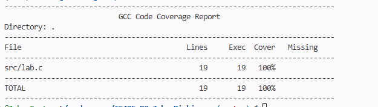

# Project 0

- Name: Jake Dickinson
- Email: jakedickinson@u.boisestate.edu
- Class: CS425-001

## Known Bugs or Issues

There are no known bugs or issues within the project! 

## Experience

I thought that the project was a great little "Getting back into the swing of things" assignment that allowed us to get our proverbial development feet under us as we get back into the semester. It certainly helped me re orient myself when it comes to programing in C as well which is by no means one of my stronger languages. I am excited to see what we continue to do this semester and I am glad that we are getting even more expiriance with code testing, even though sometimes it can make you wanna smash your head into a wall with how many times you type out almost the same line with a slight change to get the test to cover everything. This activity also provided a valuable oppertunity to use the deebugger again since I have not touched it in quite a while.

## Analysis
Here is a screenshot of my code coverage being at 100% within the 'make report' output.

